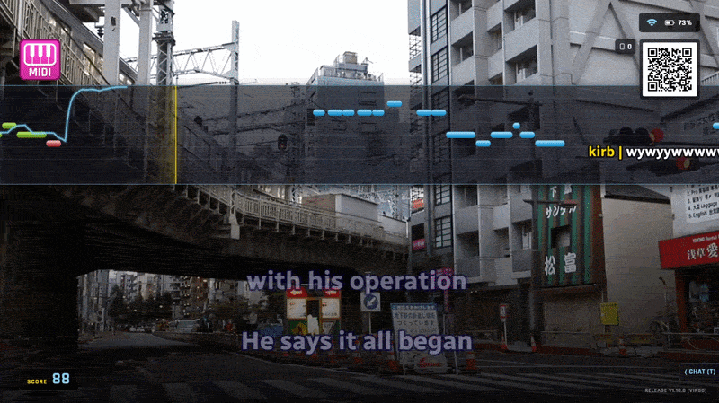
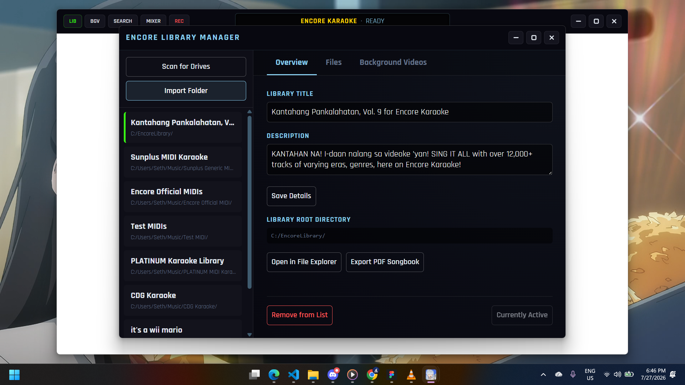

<div align="center">
  

# Encore Karaoke Player

**Experience the Asian karaoke box right on your computer, with your own music!**

</div>

<div align="center">
  
</div>

---

## Key Features

- **Real-Time Scoring**
  - Powered by our custom **Forte Audio Engine** (Web Audio API), Encore actively listens to your microphone.
  - Features live pitch tracking, real-time key-modulation detection, and a visual piano roll overlay so you know exactly when to hit those high notes (only in Multiplex & MIDI tracks).
- **Encore Sessions (Virtual Karaoke Rooms)**
  - Sing with friends and family across the world with Encore Sessions! Perfect for OFWs, LDRs, or remote karaoke hangouts with friends!
  - Queue, Cheer, and Chat in the room just like a real karaoke box.
  - Have fun with a sprinkle of competition with a score leaderboard!
- **EnMoku! (Mobile Remote Control)**
  - No more passing a bulky songbook around! Just scan the QR code on the screen to connect your smartphone.
  - No additional app installs needed! EnMoku works straight in your web browser. (Chromium-based browsers (e.g., Chrome, Edge) and Firefox)
  - Queue tracks, send "Cheers", chat with the room, and turn your phone into a camera in one tap!
  - Works seamlessly on your local network, with a Cloud tunnel fallback for devices not on the same network.
- **Versatile Media Support (MTVs & Multiplex)**
  - Supports MIDI karaoke (`.mid`, `.kar`) with SoundFont (`.sf2`, `.sf3` & `.dls`) playback.
  - Supports audio tracks (`.mp3`, `.wav`, `.m4a`, `.ogg`) paired with `.lrc` lyrics or CDG.
  - Supports high-quality MTVs (Music Videos) (`.mp4`, `.mkv`, `.webm`, `.avi`).
  - Full support for **Multiplex tracks** (pan left/right to toggle the guide vocal).
- **Native YouTube Integration**
  - Don't have a song in your local library? Search YouTube directly from the player or your phone and queue it up instantly.
- **Instant Recording**
  - Record your best vocal performances directly to your hard drive with the press of a button.
- **Pitch & Latency Control**
  - Adjust pitch (transpose) and tempo on the fly.
  - Calibrate your microphone and signal chain's latency quickly.
- **Japanese & Korean Romanization**
  - Love singing K-pop but can't read the language? What about your favorite anime openings? Encore automatically generates romanized lyrics for Japanese and Korean in real time.
  - Also supports Furigana (Ruby text) for MIDI karaoke files.
- **Discord Rich Presence**
  - Automatically shows what you're singing on your Discord status.

---

# Getting Started

## Library Setup

> [!WARNING]
> For legal reasons, Encore does not come with a Song Library by default. Learn more on how you can make your own libraries below, or contact us at [sky@encorekaraoke.org](mailto:sky@encorekaraoke.org).

Encore automatically scans your local drives for a folder named **`EncoreLibrary`**, or you can use the Library Manager to import your library.

<div align="center">
  
</div>

To build your library, structure your files like this:

```text
D:/EncoreLibrary/                                             # Should work for any folder
 ├── manifest.json                                            # Metadata and BGV (Background Video) configs
 ├── [Your Artist] - [Song].mp3                               # Audio file (Compatible with ID3 tags)
 ├── [Your Artist] - [Song].lrc                               # Matching LRC lyrics file
 ├── [Your Artist] - [Song].cdg                               # or matching CDG file
 ├── [Your Artist] - [Song].mp4                               # Video files for MTV
 ├── [Your Artist] - [Song].mid or [Your Artist] - [Song].kar # MIDI files
 └── [Your Artist] - [Song].chorus.ogg                        # Backing vocals for MIDI files (OGG is recommended)
```

_Note: For Multiplex tracks (where vocals are on one channel and instrumentals on the other), add `.multiplexed.` to the filename before the extension (e.g., `Song.multiplexed.mp3`)._

---

## Controls & Shortcuts

Encore can be fully controlled via a standard keyboard or through EnMoku.

| Key             | Action                                               |
| :-------------- | :--------------------------------------------------- |
| `0-9`           | Type song code to reserve/play                       |
| `Enter`         | Confirm reservation / Play highlighted song          |
| `Escape`        | Stop playback / Clear input / Go back                |
| `Space`         | Pause playback                                       |
| `Y`             | Open Search Menu (Local + YouTube)                   |
| `Q`             | Open Reservation List                                |
| `M`             | Open Mixer (Adjust Mic & Music levels)               |
| `R`             | Toggle recording (during playback) / View recordings |
| `S`             | Open Encore Sessions menu                            |
| `T`             | Chat (In a session)                                  |
| `C`             | Toggle Chorus on/off                                 |
| `- / =`         | Adjust volume                                        |
| `Shift + - / =` | Adjust mic monitoring volume                         |
| `Up / Down`     | Pitch shift (Transpose) up/down                      |
| `Left / Right`  | Multiplex pan (Toggle guide vocal on/off)            |
| `' / "`         | Change drum presets                                  |
| `[ / ]`         | Cycle background videos (BGVs) / Video sync offset   |
| `F2`            | Enter Setup Mode (in main menu)                      |
| `Space`         | Pause playback                                       |

---

## Configuration & Setup Mode

Pressing **`F2`** in the Main Menu will put you into **Setup Mode**. Setup Mode is a PIN-protected (default: `0000`) menu that allows you to:

- Change your target Library path.
- Select the specific Microphone (Input) and Speaker (Output) hardware.
- Adjust Master Volume and Mic Latency overrides.
- Calibrate Video Sync offsets.
- Change the Security PIN (Recommended).

---

## Development & Running Locally

### Installing

> [!NOTE]
> Currently, versions 1.0.0 to 1.3.1 are only available for Windows. Future versions (1.4.0+) support Linux.

Ready-to-use installers are available on the [Releases](https://github.com/Encore-Karaoke-Labs/Encore-Karaoke/releases) page.

### Building

1. **Clone the repository:**

   ```bash
   git clone https://github.com/Encore-Karaoke-Labs/Encore-Karaoke.git
   cd Encore-Karaoke
   ```

2. **Install dependencies:**

   ```bash
   npm i
   ```

3. **Run the app:**

   ```bash
   npm run start
   ```

4. **Build the app on your platform:**

   ```bash
   npm run make
   ```

_To run in full-screen Kiosk mode (which disables Windows Explorer that may improve performance), pass the `--kiosk` flag._

### Contributing

**Please refer to our [Contributing](CONTRIBUTING.md) document for more information.**

For the best experience contributing towards Encore, we recommend using [Visual Studio Code](https://code.visualstudio.com) with the Prettier extension.

---

# Credits & Acknowledgments

## Awesome libraries that make Encore possible

- **Underlying framework**: [Cherry Tree / Terebi](https://github.com/terebiorg/terebi)
- **Audio Playback**:
  - ID3 metadata support is powered by [jsmediatags](https://github.com/aadsm/jsmediatags).
  - MIDI playback is powered by [SpessaSynth](https://github.com/spessasus/SpessaSynth).
  - Pitch detection is handled by [Pitchy](https://github.com/ianprime0509/pitchy).
  - Key detection by [Meyda](https://meyda.js.org/).
- **Romanization**:
  - Japanese transliteration powered by [Kuroshiro](https://kuroshiro.org/).
  - Korean transliteration powered by [Aromanize](https://github.com/fujaru/aromanize-js/).
- **Discord RPC**: [discord-rpc](https://github.com/xhayper/discord-rpc).

## Cool people that made Encore great!

- **[Stariix](https://www.youtube.com/@Stariixy)**:
  - 3D BGV development
  - Voice provider for Encore's score sounds
  - Creator and designer behind Encore's mascot, Akiyama Hoshi
- **[MTSyntho](https://github.com/MTSyntho)**
  - Provided resources for Linux support
- **[prjoni99](https://github.com/prjoni99)**:
  - Provided resouces for Mac support
  - Indicated the app's first potential security flaws
- **[Spessasus](https://github.com/spessasus/)**:
  - Creator of SpessaSynth, the synthesizer that powers Encore
  - Has provided code suggestions & deeper insights to SpessaSynth
- **[Objecty](https://www.youtube.com/@objecty)**:
  - Designer behind Encore's format indicators
- **[Lap](https://github.com/ItsLap)** & **[Kat21](https://github.com/datkat21)**
  - Creators of the Cherry Tree core, the underlying framework running Encore
